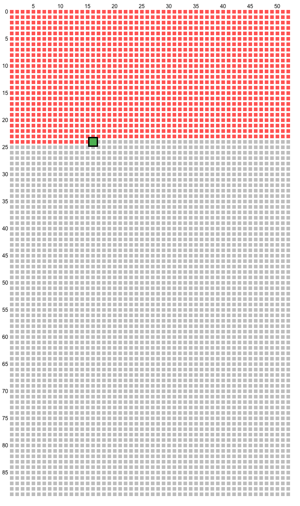

# This Is Your Life

Excerpt from the [site this was inspired from](https://waitbutwhy.com/2014/05/life-weeks.html)

*Sometimes life seems really short, and other times it seems impossibly long. But this chart helps to emphasize that it’s most certainly finite. Those are your weeks and they’re all you’ve got. Given that fact, the only appropriate word to describe your weeks is precious. There are **trillions upon trillions** of weeks in eternity, and those are your tiny handful.*

## Overview

This Chrome extension auto-creates a simple diagram outlining your life so far - a grid of squares. Each square represents a week and each row represents a year. Weeks (and years) passed are colored red and the current week is green.

This gives a simple but powerful perspective on life, showing how limited the time that we have is. 

Although the current life expectancy is typically lower, this calendar counts until you turn **90** (can't hurt to be optimistic).

## What's the Point of This?

Weekly reflection is a common practice to track progress and growth over one's life, and is often done in a digital diary (e.g., [Roam](https://roamresearch.com/), [Notion](https://www.notion.so/)). There wasn't an easy way to automatically create this diagram for use in weekly reflection, so I made this to automate it.

## Usage

- Set up your birthdate in the extension Options (`Right click extension icon > Options`)
- Click the extension icon to bring up a small preview of your **Life In Weeks**
- A high-res version of this can then be copied into your favourite notetaking app (`Right click image > Copy Image`), or saved to your computer (`Right click image > Save Image As`).
